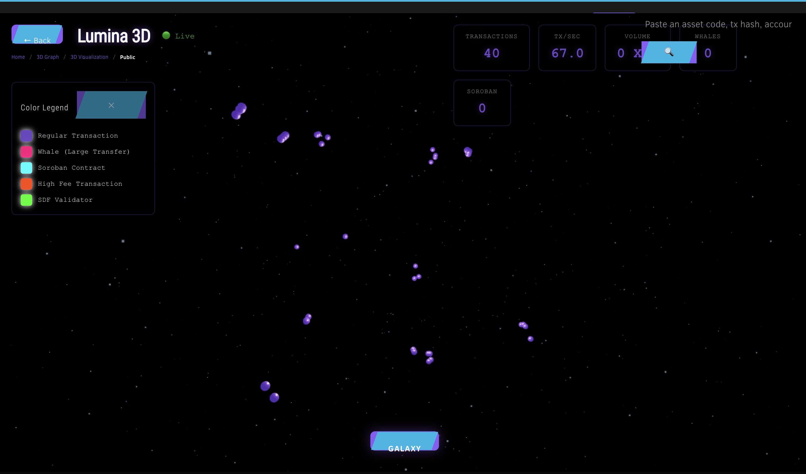
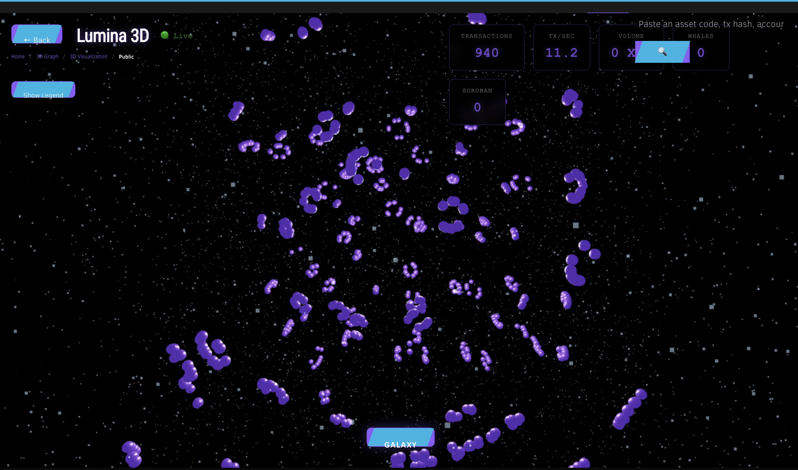

# Lumina 3D Modern Stellar Explorer

Lumina 3D Modern Stellar Explorer – block explorer and analytics platform
for [Stellar Network](https://stellar.org).

## Screenshots

### 3D Transaction Visualization

*Live 3D visualization of blockchain transactions in a galaxy view*

### 3D Galaxy View

*Interactive galaxy view showing real-time transaction clusters and network activity*

### Assets Dashboard

*Comprehensive assets dashboard with statistics, charts, and detailed asset listings*


## API Server

#### Install dependencies

```
cd api
npm i
```

#### Configuration

**Quick Setup:**
```bash
# Run the setup script to create .env files
./setup-env.sh
```

**Manual Setup:**

All configuration parameters can be set via:
1. Environment variables (`.env` file) - Recommended for sensitive data
2. `app.config.json` file - For non-sensitive configuration

Copy the template config file and edit parameters:

```
cp example.app.config.json app.config.json
```

**Environment Variables (api/.env):**

| Variable | Description | Default | Required |
|----------|-------------|---------|----------|
| `PORT` | API server port | `3000` | No |
| `NODE_ENV` | Node environment (`development`/`production`) | `development` | No |
| `MODE` | Logging mode (`development` for verbose) | - | No |
| `MONGODB_URI` | MongoDB connection string | From `app.config.json` | Recommended |
| `MONGODB_ARCHIVE_URI` | Archive MongoDB connection | From `app.config.json` | Recommended |
| `ELASTICSEARCH_URL` | Elasticsearch URL | `http://localhost:9201` | Recommended |
| `HORIZON_URL_PUBLIC` | Public network Horizon URL | `https://horizon.stellar.org` | Recommended |
| `HORIZON_URL_TESTNET` | Testnet Horizon URL | `https://horizon-testnet.stellar.org` | Recommended |
| `API_CACHE_DISABLED` | Disable API response caching | `false` | No |
| `CORS_WHITELIST` | Comma-separated CORS origins | From `app.config.json` | No |
| `DIRECTORY_REPO_OWNER` | GitHub repo owner for directory | - | If using directory |
| `DIRECTORY_REPO_NAME` | GitHub repo name for directory | - | If using directory |
| `DIRECTORY_ACCESS_TOKEN` | GitHub access token | - | If using directory |
| `GITHUB_OAUTH_CLIENT_ID` | GitHub OAuth client ID | - | If using OAuth |
| `GITHUB_OAUTH_SECRET` | GitHub OAuth secret | - | If using OAuth |
| `BILLING_SERVER_URL` | Billing server WebSocket URL | - | If using billing |
| `BILLING_SERVICE_TOKEN` | Billing service token | - | If using billing |
| `PROXY_VALIDATION_KEY` | Proxy validation key | - | No |
| `TURNSTILE_SECRET` | Cloudflare Turnstile secret | - | If using Turnstile |
| `ENABLE_3D_STREAM` | Enable 3D transaction streaming | `true` | No |
| `ENABLE_SSE_STREAMING` | Enable Server-Sent Events | `true` | No |

**Frontend Environment Variables (ui/.env):**

| Variable | Description | Default | Required |
|----------|-------------|---------|----------|
| `REACT_APP_API_ENDPOINT` | API server URL | `http://localhost:3000` | Yes |
| `REACT_APP_DEFAULT_NETWORK` | Default network (`public`/`testnet`) | `public` | No |
| `REACT_APP_HORIZON_URL_PUBLIC` | Public Horizon URL | `https://horizon.stellar.org` | No |
| `REACT_APP_HORIZON_URL_TESTNET` | Testnet Horizon URL | `https://horizon-testnet.stellar.org` | No |
| `REACT_APP_GITHUB_OAUTH_CLIENT_ID` | GitHub OAuth client ID | - | If using OAuth |
| `REACT_APP_TURNSTILE_KEY` | Cloudflare Turnstile site key | - | If using Turnstile |
| `REACT_APP_ENABLE_3D_VIEW` | Enable 3D visualization | `true` | No |
| `REACT_APP_ENABLE_SSE_STREAMING` | Enable SSE streaming | `true` | No |
| `REACT_APP_ENABLE_VR_MODE` | Enable VR mode | `false` | No |
| `REACT_APP_3D_MAX_PARTICLES` | Max particles in 3D view | `2000` | No |
| `REACT_APP_3D_TARGET_FPS` | Target FPS for 3D rendering | `60` | No |
| `REACT_APP_3D_WHALE_THRESHOLD` | Whale threshold in XLM | `50000` | No |
| `REACT_APP_3D_HIGH_FEE_THRESHOLD` | High fee threshold in stroops | `10000000` | No |
| `REACT_APP_OPENROUTER_API_KEY` | OpenRouter API key for AI insights | - | Optional |
| `REACT_APP_OPENROUTER_MODEL` | AI model to use (e.g., `anthropic/claude-3.5-sonnet`) | `anthropic/claude-3.5-sonnet` | No |

**app.config.json Configuration:**

- `port` - API server port (overridden by `PORT` env var)
- `apiCacheDisabled` - set to `true` to disable response caching (recommended
  for development environment)
- `networks` - supported Stellar networks configuration
    - `db` - connection string Mongodb database with ingested ledger data
    - `archive` - archive database connection string
    - `horizon` - URL of the public Horizon server,
    - `network` - network identifier
- `directory` - public Directory configuration
    - `repository` - Github repository identifier in the
      format `{owner}/{repository}`
    - `accessToken` - Github access token for the bot with repository access
    - `admins` - handles of the users with write permissions to the repository
- `oauth` - OAuth providers configuration
    - `clientId` - application ClientId obtained from OAuth provider
    - `secret` - corresponding secret
- `corsWhitelist` - array containing all origins that will have CORS enabled for
  all requests

#### Start

```
node api.js
```

(for verbose HTTP requests logging pass `MODE=development` environment variable)

## Frontend

#### Install dependencies

```
cd ui
pnpm i
```

(requires PNPM package manager to be installed)

#### Configuration

All configuration parameters stored in `app.config.json` file.

- `apiEndpoint` - URL of the API sever
- `networks` - supported Stellar networks configuration
    - `passphrase` - network passphrase
    - `horizon` - URL of the public Horizon server,
    - `title` - friendly name
- `directoryAdmins` - handles of the users with write permissions to the
  Directory repository
- `oauth` - OAuth providers configuration
    - `clientId` - application ClientId obtained from OAuth provider

Additional build options are located in `webpack-config.js`

#### Start the application in the development mode

```
pnpm dev-server
```

*(check webpack dev-server output for the hot-reload browser link)*

#### Build production bundle

```
pnpm build
```

*(check for the generated files in the `./public` repository)*

